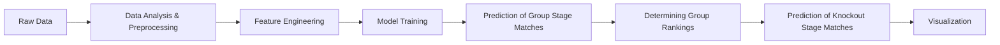
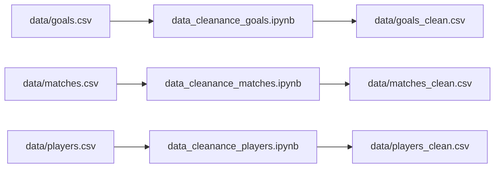
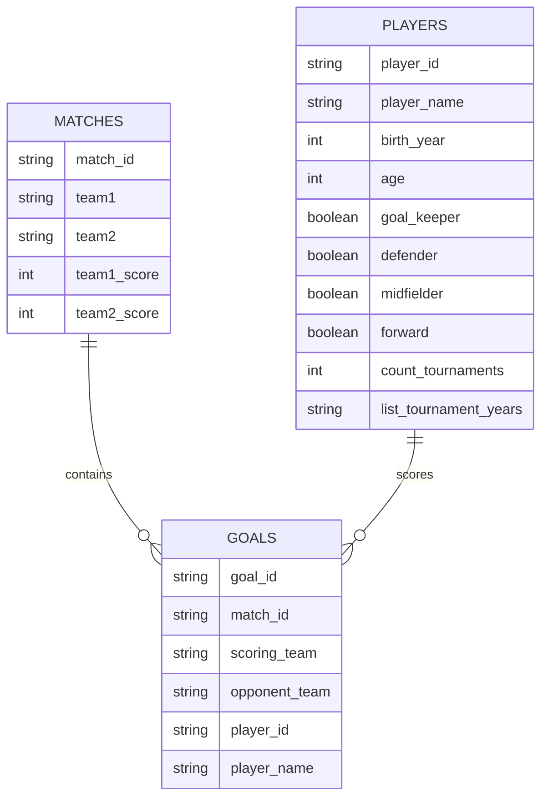
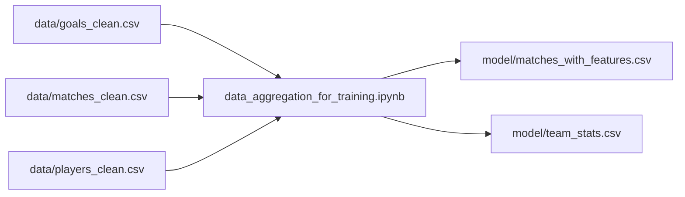
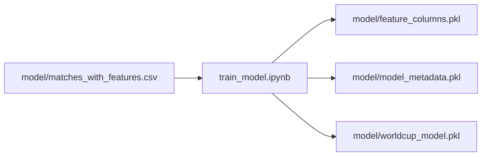
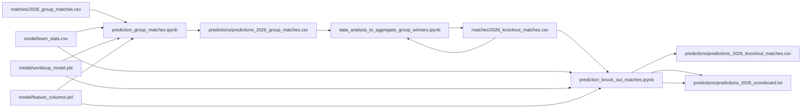

# World Cup Predictor
This project was inspired by [Paul, the octopus](https://youtu.be/r9WE7TRl91c?si=FP-dx6bWlCw4p3RK), 
who famously predicted the outcomes of several matches during the 2010 FIFA World Cup.

The World Cup Predictor is a collection of Python notebooks that build a complete prediction pipeline for the 2026 FIFA World Cup. 
The project combines data preparation, machine learning, and tournament simulation to predict match outcomes and determine the most likely tournament winner.

The workflow includes:
- Data cleaning and preprocessing
- Feature aggregation and dataset preparation
- Model training and evaluation
- Prediction of group stage matches
- Group stage analysis to determine advancing teams
- Prediction of knockout stage matches
- Full tournament simulation to identify the World Cup champion

The main objective of this project is to predict the winner of FIFA World Cup matches in 2026.

During the group stage, the two highest-performing teams from each group advance to the knockout stage. 
By simulating every knockout match, the project ultimately predicts the team most likely to win the World Cup.

## Data analysis and preprocessing
This project uses historical FIFA World Cup tournament data from the 21st century as the foundation for training and evaluation.
Source: https://github.com/jfjelstul/worldcup/tree/master/data-csv

The raw tournament data is cleaned and transformed before being used for model training and prediction.

The `data` directory contains raw input datasets in CSV format and the cleaned data, which is used for the next step: feature engineering.
The following entity-relationship diagram illustrates the structure and relationships of the data used throughout the project.

### Feature engineering
In this step, the cleaned data from the previous stage, including goals, matches, and player information,
is aggregated to generate team-level statistics, saved in `model/team_stats.csv`:
- Total goals scored
- Total number of players who scored at least one goal
- Maximum number of goals scored by a single player
- Total matches played
- Number of matches with goals scored
- Number of matches without goals scored
- Average number of goals scored per match

Additionally, the matches dataset is transformed to better support model training.
For each match record a duplicated version is created where:
- `team1` and `team2` are swapped
- the match outcome is converted into a boolean target variable named `win`
- `team1_score` and `team2_score` are swapped
This approach allows the model to learn from both team perspectives and helps reduce positional bias.

Note: Draws are treated as losses. Therefore the `win` is set to `false` for both match records.

To further enrich the training data:
- team-specific feature columns are added to each match record
  - suffixes `_team1`or `_team2` are used
  - example: `total_goals_team1, `avg_goals_per_match_team2`, ...
- comparative feature columns are added to capture the performance difference between both teams
  - example: `goals_diff`, `matches_diff`, `avg_goals_diff`, ... 

## Model training
The model is trained using the dataset enriched with features: `matches_with_features.csv`.
All feature columns are used as input variables (X), including team-specific features (suffix: `_team1`, `_team2`) and comparative features (suffix: `diff`)
The target variable (Y) is the boolean column `win`.

Then the dataset is split into training and testing subsets using an 80/20 ratio 
and a simple Random Forest classifier is trained on the prepared dataset.

# TODO: Model tuning
- Random Forest / XGBoost / LightGBM or Logistic Regression (great baseline)
- Gradient Boosted Trees?

## Prediction
To predict the outcome of the 2026 FIFA World Cup, 
the trained model is applied to all tournament matches using a three-step prediction pipeline:
1. `prediction_group_matches.ipynb`
   - Generate predictions for all group stage matches using the trained model
2. `data_analysis_to_aggregate_group_winners.ipynb`
   - Calculate group standings based on the predicted match outcomes 
   - Select the top two teams from each group to advance to the knockout stage
   - Prepare the match data for the next prediction step
3. `prediction_knock_out_matches.ipynb`
   - Generate predictions for all knockout matches round by round using the trained model
   - Visualize match statistics

Note: Since some countries have not qualified for any of the 21th century world  cups.
As a result, no historical statistics are available for them in `team_stats.csv`.
To avoid unfairly penalizing or overestimating these teams, missing team statistics are replaced with the average team strength across all available teams.
For more realistic output, the region average or external ratings could have been considered.

## Future work
Since the current dataset mainly focuses on goal scores, 
several improvements could further enhance the prediction quality and realism of the model:
- Add more advanced team features, including aplayer age, world cup / tournament experience, team consistency
- Incorporate tactical information, player positions, possesive and defense strength
- Integrate external ranking systems

## Local Setup
1. Set up environment \
   `python -m venv venv` \
   `source venv/bin/activate` \
   `pip install -r requirements.txt`
2. Run Notebooks
Since the output of the data cleaning, feature engineering and model training is already provided in this repository,
only the prediction step needs to be executed, by running the following notebooks:
- `prediction_group_matches.ipynb`
- `data_analysis_to_aggregate_group_winners.ipynb`
- `prediction_knock_out_matches.ipynb`
3. Check the winner of the worldcup 
- View the output of the last notebook executed or analyze the output files in the predictions folder.
  - [scoreboard](./predictions/predictions_2026_scoreboard.txt)
  - [knockout matches](./predictions/predictions_2026_knockout_matches_complete.csv)

