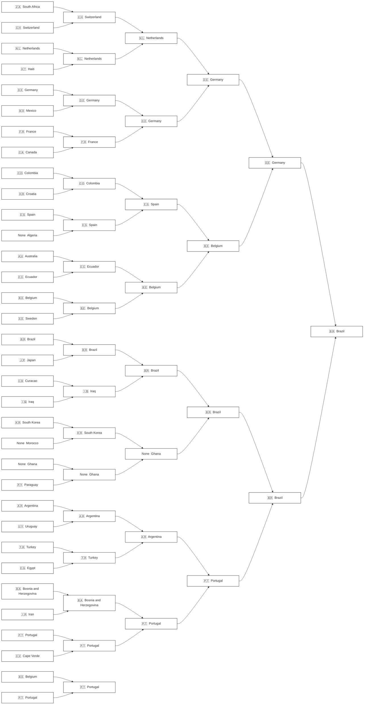

```mermaid
graph LR
    %%{init: { "themeCSS": " .node rect { fill: transparent !important; stroke: black !important;}"}}%%
    SouthAfrica_32["<div style="width:200px;text-align:center">🇿🇦  South Africa</div>"] --> Switzerland_16["<div style="width:200px;text-align:center">🇨🇭  Switzerland</div>"]
    Switzerland_32["<div style="width:200px;text-align:center">🇨🇭  Switzerland</div>"] --> Switzerland_16
    Netherlands_32["<div style="width:200px;text-align:center">🇳🇱  Netherlands</div>"] --> Netherlands_16["<div style="width:200px;text-align:center">🇳🇱  Netherlands</div>"]
    Haiti_32["<div style="width:200px;text-align:center">🇭🇹  Haiti</div>"] --> Netherlands_16
    Germany_32["<div style="width:200px;text-align:center">🇩🇪  Germany</div>"] --> Germany_16["<div style="width:200px;text-align:center">🇩🇪  Germany</div>"]
    Mexico_32["<div style="width:200px;text-align:center">🇲🇽  Mexico</div>"] --> Germany_16
    France_32["<div style="width:200px;text-align:center">🇫🇷  France</div>"] --> France_16["<div style="width:200px;text-align:center">🇫🇷  France</div>"]
    Canada_32["<div style="width:200px;text-align:center">🇨🇦  Canada</div>"] --> France_16
    Colombia_32["<div style="width:200px;text-align:center">🇨🇴  Colombia</div>"] --> Colombia_16["<div style="width:200px;text-align:center">🇨🇴  Colombia</div>"]
    Croatia_32["<div style="width:200px;text-align:center">🇭🇷  Croatia</div>"] --> Colombia_16
    Spain_32["<div style="width:200px;text-align:center">🇪🇸  Spain</div>"] --> Spain_16["<div style="width:200px;text-align:center">🇪🇸  Spain</div>"]
    Algeria_32["<div style="width:200px;text-align:center">None  Algeria</div>"] --> Spain_16
    Australia_32["<div style="width:200px;text-align:center">🇦🇺  Australia</div>"] --> Ecuador_16["<div style="width:200px;text-align:center">🇪🇨  Ecuador</div>"]
    Ecuador_32["<div style="width:200px;text-align:center">🇪🇨  Ecuador</div>"] --> Ecuador_16
    Belgium_32["<div style="width:200px;text-align:center">🇧🇪  Belgium</div>"] --> Belgium_16["<div style="width:200px;text-align:center">🇧🇪  Belgium</div>"]
    Sweden_32["<div style="width:200px;text-align:center">🇸🇪  Sweden</div>"] --> Belgium_16
    Brazil_32["<div style="width:200px;text-align:center">🇧🇷  Brazil</div>"] --> Brazil_16["<div style="width:200px;text-align:center">🇧🇷  Brazil</div>"]
    Japan_32["<div style="width:200px;text-align:center">🇯🇵  Japan</div>"] --> Brazil_16
    Curacao_32["<div style="width:200px;text-align:center">🇨🇼  Curacao</div>"] --> Iraq_16["<div style="width:200px;text-align:center">🇮🇶  Iraq</div>"]
    Iraq_32["<div style="width:200px;text-align:center">🇮🇶  Iraq</div>"] --> Iraq_16
    SouthKorea_32["<div style="width:200px;text-align:center">🇰🇷  South Korea</div>"] --> SouthKorea_16["<div style="width:200px;text-align:center">🇰🇷  South Korea</div>"]
    Morocco_32["<div style="width:200px;text-align:center">None  Morocco</div>"] --> SouthKorea_16
    Ghana_32["<div style="width:200px;text-align:center">None  Ghana</div>"] --> Ghana_16["<div style="width:200px;text-align:center">None  Ghana</div>"]
    Paraguay_32["<div style="width:200px;text-align:center">🇵🇾  Paraguay</div>"] --> Ghana_16
    Argentina_32["<div style="width:200px;text-align:center">🇦🇷  Argentina</div>"] --> Argentina_16["<div style="width:200px;text-align:center">🇦🇷  Argentina</div>"]
    Uruguay_32["<div style="width:200px;text-align:center">🇺🇾  Uruguay</div>"] --> Argentina_16
    Turkey_32["<div style="width:200px;text-align:center">🇹🇷  Turkey</div>"] --> Turkey_16["<div style="width:200px;text-align:center">🇹🇷  Turkey</div>"]
    Egypt_32["<div style="width:200px;text-align:center">🇪🇬  Egypt</div>"] --> Turkey_16
    BosniaandHerzegovina_32["<div style="width:200px;text-align:center">🇧🇦  Bosnia and Herzegovina</div>"] --> BosniaandHerzegovina_16["<div style="width:200px;text-align:center">🇧🇦  Bosnia and Herzegovina</div>"]
    Iran_32["<div style="width:200px;text-align:center">🇮🇷  Iran</div>"] --> BosniaandHerzegovina_16
    Portugal_32["<div style="width:200px;text-align:center">🇵🇹  Portugal</div>"] --> Portugal_16["<div style="width:200px;text-align:center">🇵🇹  Portugal</div>"]
    CapeVerde_32["<div style="width:200px;text-align:center">🇨🇻  Cape Verde</div>"] --> Portugal_16
%%%%
    Switzerland_16["<div style="width:200px;text-align:center">🇨🇭  Switzerland</div>"] --> Netherlands_8["<div style="width:200px;text-align:center">🇳🇱  Netherlands</div>"]
    Netherlands_16["<div style="width:200px;text-align:center">🇳🇱  Netherlands</div>"] --> Netherlands_8
    Germany_16["<div style="width:200px;text-align:center">🇩🇪  Germany</div>"] --> Germany_8["<div style="width:200px;text-align:center">🇩🇪  Germany</div>"]
    France_16["<div style="width:200px;text-align:center">🇫🇷  France</div>"] --> Germany_8
    Colombia_16["<div style="width:200px;text-align:center">🇨🇴  Colombia</div>"] --> Spain_8["<div style="width:200px;text-align:center">🇪🇸  Spain</div>"]
    Spain_16["<div style="width:200px;text-align:center">🇪🇸  Spain</div>"] --> Spain_8
    Ecuador_16["<div style="width:200px;text-align:center">🇪🇨  Ecuador</div>"] --> Belgium_8["<div style="width:200px;text-align:center">🇧🇪  Belgium</div>"]
    Belgium_16["<div style="width:200px;text-align:center">🇧🇪  Belgium</div>"] --> Belgium_8
    Brazil_16["<div style="width:200px;text-align:center">🇧🇷  Brazil</div>"] --> Brazil_8["<div style="width:200px;text-align:center">🇧🇷  Brazil</div>"]
    Iraq_16["<div style="width:200px;text-align:center">🇮🇶  Iraq</div>"] --> Brazil_8
    SouthKorea_16["<div style="width:200px;text-align:center">🇰🇷  South Korea</div>"] --> Ghana_8["<div style="width:200px;text-align:center">None  Ghana</div>"]
    Ghana_16["<div style="width:200px;text-align:center">None  Ghana</div>"] --> Ghana_8
    Argentina_16["<div style="width:200px;text-align:center">🇦🇷  Argentina</div>"] --> Argentina_8["<div style="width:200px;text-align:center">🇦🇷  Argentina</div>"]
    Turkey_16["<div style="width:200px;text-align:center">🇹🇷  Turkey</div>"] --> Argentina_8
    BosniaandHerzegovina_16["<div style="width:200px;text-align:center">🇧🇦  Bosnia and Herzegovina</div>"] --> Portugal_8["<div style="width:200px;text-align:center">🇵🇹  Portugal</div>"]
    Portugal_16["<div style="width:200px;text-align:center">🇵🇹  Portugal</div>"] --> Portugal_8
%%%%
    Netherlands_8["<div style="width:200px;text-align:center">🇳🇱  Netherlands</div>"] --> Germany_4["<div style="width:200px;text-align:center">🇩🇪  Germany</div>"]
    Germany_8["<div style="width:200px;text-align:center">🇩🇪  Germany</div>"] --> Germany_4
    Spain_8["<div style="width:200px;text-align:center">🇪🇸  Spain</div>"] --> Belgium_4["<div style="width:200px;text-align:center">🇧🇪  Belgium</div>"]
    Belgium_8["<div style="width:200px;text-align:center">🇧🇪  Belgium</div>"] --> Belgium_4
    Brazil_8["<div style="width:200px;text-align:center">🇧🇷  Brazil</div>"] --> Brazil_4["<div style="width:200px;text-align:center">🇧🇷  Brazil</div>"]
    Ghana_8["<div style="width:200px;text-align:center">None  Ghana</div>"] --> Brazil_4
    Argentina_8["<div style="width:200px;text-align:center">🇦🇷  Argentina</div>"] --> Portugal_4["<div style="width:200px;text-align:center">🇵🇹  Portugal</div>"]
    Portugal_8["<div style="width:200px;text-align:center">🇵🇹  Portugal</div>"] --> Portugal_4
%%%%
    Germany_4["<div style="width:200px;text-align:center">🇩🇪  Germany</div>"] --> Germany_2["<div style="width:200px;text-align:center">🇩🇪  Germany</div>"]
    Belgium_4["<div style="width:200px;text-align:center">🇧🇪  Belgium</div>"] --> Germany_2
    Brazil_4["<div style="width:200px;text-align:center">🇧🇷  Brazil</div>"] --> Brazil_2["<div style="width:200px;text-align:center">🇧🇷  Brazil</div>"]
    Portugal_4["<div style="width:200px;text-align:center">🇵🇹  Portugal</div>"] --> Brazil_2
%%%%
    Belgium_2["<div style="width:200px;text-align:center">🇧🇪  Belgium</div>"] --> Portugal_1["<div style="width:200px;text-align:center">🇵🇹  Portugal</div>"]
    Portugal_2["<div style="width:200px;text-align:center">🇵🇹  Portugal</div>"] --> Portugal_1
    Germany_2["<div style="width:200px;text-align:center">🇩🇪  Germany</div>"] --> Brazil_1["<div style="width:200px;text-align:center">🇧🇷  Brazil</div>"]
    Brazil_2["<div style="width:200px;text-align:center">🇧🇷  Brazil</div>"] --> Brazil_1
```